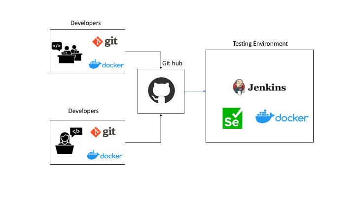

[Back To Topic List](README.md)

# Software development tools and practices to improve productivity and competitiveness

The technological innovations in computer hardware and software changed the way companies do business. In order  to stay competitive at a global level, companies have to adopt the latest technologies faster than its competitors. For example, the delay in adopting e-commerce made companies like Walmart and Macy's lose their competitive advantage to Amazon. 

## Git
Developing large and complex software requires collaboration of multiple developers. A version control system like git will make it easier for multiple developers to work on one project and keep track of code changes, bugs, bug fixes, releases etc. This inturn helps the companies to lower the cost of software development.

## Docker
A version control system like git has a centralized repository. A developer usually creates a copy of this repository in his local machine to do the development. In large projects, it is impossible for every developer to have a local machine with the exact same system configurations and dependencies required to run the code from the repository. 

In order to solve this issue all the developers in the project had to emulate the same system configurations. Virtual machines were a popular choice for this until the introduction of Docker. Docker made it possible to emulate multiple linux environments on a machine by using less resources compared to virtual machines. A developer will create a docker container with the configuration specified in the project repository. The code will be developed and tested in that container. 

## Continuous Integration
When multiple developers work on a project, it is possible that more than one developer make changes to the same files. This can lead to conflicts and errors if not resolved properly. In order to solve this problem developers are encouraged to commit their changes and integrate it to the remote repository more often. This continuous integration will help to make sure that the central repository is as up-to-date as possible. 

## Automated Testing
Whenever a new commit is merged with the remote repository, it should be tested to make sure that the new changes are not breaking existing code. Since it is impossible to manually test all the scenarios automated testing must be used to ensure the quality of the software. Continuous integration tools like Jenkins and automated testing tools like Selenium can be used along with git to make sure all new integrations are tested right away to minimize the bugs. In order to use automated testing with continuous integration, the developers and testers should come up with good test cases that test all the scenarios. 

[Back To Topic List](README.md)
