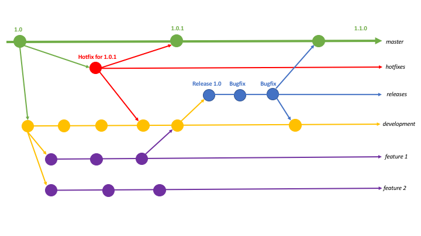

[Back To Topic List](README.md)

# GitFlow Workflow 

Git is a version control system that helps developers to keep track of code changes. Development team uses git in different ways in their projects. Two of the popular branching models using git are GitFlow and Github Flow. GitFlow was introduced by Vicent Driessen in 2010. 

## Development
In GitFlow methodology, the git repository will have a develop branch that is branched off from the master branch tagged for a new release. The development team will create a feature branch from the develop branch for every new feature added to the software and for non-emergency bug-fixes. This will help the team to isolate new features that are under development from master and develop branches. Once the features are finished, they will be merged back into the develop branch. 

## Releases 
A release branch will be created from the develop branch. The code will be tested in the release branch. A bug found during the testing phase of a feature branch will be fixed in the release branch itself. After the release, the release branch will be merged with the master branch and develop branch. 

## Hotfixes
If there is an emergency hotfix required after deployment, it will be done on a  hotfix branch  created from the master branch. The hotfixes branch will be merged to both the master and develop branches to keep them in sync. 

[Back To Topic List](README.md)
