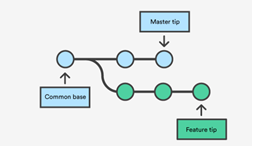
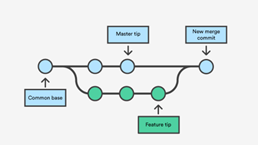
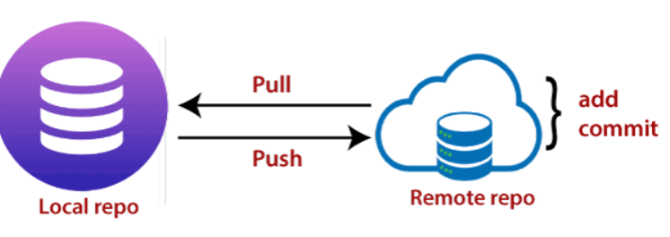
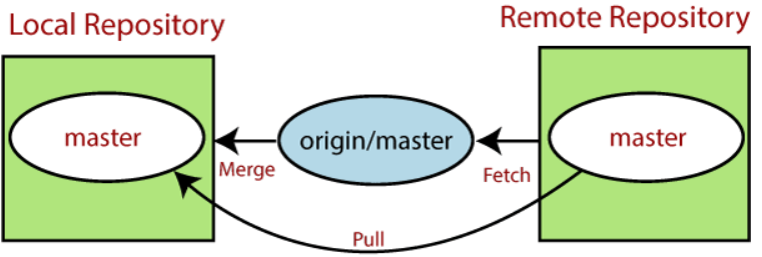
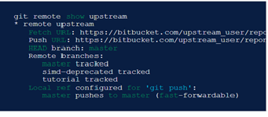
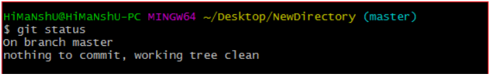

[Back To Topic List](README.md)

# Git commands and terminology:

## Branch
A branch helps to separate a specific set of changes from others. Developers can create a branch to keep track of a particular feature that is being added to the application. For example an ‘authentication’ branch can be created to keep track of all the changes made to implement a user registration and login feature in a web application

A new branch can be created using the following commands

```
Git branch newBranch

Git checkout -b newBranch
```

## Commit
A commit is the snapshot of the state of files. A developer should commit his code to the appropriate branch to make sure it is tracked. 
		
A commit can be made using the following commands

```
Git add .

Git commit

Git commit -a

Git commit -m

Git commit -am
```

## Merge
Merging  is Git's way of putting together a united history again. The git merge command allows you to take independent lines of development made by a git branch and merge it into a single branch.	

Example:- 
We have a new branch feature that is based off the master branch. We now want to merge this feature branch into master.



Using this command we have a new branch feature that is based off the master branch. We now want to merge this feature branch into master.



## Checkout

The git checkout command lets you navigate between the branches created by git branch. 

```	
 git checkout -b <branchname>  

git checkout -b <branchname>  

git checkout <remotebranch> origin/<remotebranch> 
```

## Push

The git push command allows you to send the commits from your local branch in your local Git repository to the remote repository.

Before you push from local to the remote repository, you must make sure that all the changes are committed on the local repository.

```
 git push <repo name> <branch name>
```


## Pull

Git Pull allows the other to view the changes you have made to the repository that you are currently working on. 

```
git pull 'remote_name' 'branch_name'
```


## Remote Add / Remove / Show
 
Remote Add:  The git remote add command takes two arguments:

A unique remote name, for example, “remote_repo”

A remote URL, which you can find on the Source sub-tab of your Git repo.

Example: 

```
set a new remote

git remote add “Remote name” git@ “URL”

git remote -v
```

Remote Remove : It is used to remove the remote URL from your repository.

The “git remote rm” command takes one argument:

A remote name, for example, destination

Example: 
```
git remote rm destination

# Remove remote	

$ git remote -v
```


Remote Show: The show subcommand in git remote  gives detailed output on the configuration of a remote. 

This output will contain a list of branches associated with the remote and also the endpoints attached for fetching and pushing.

Example:

```
git remote show upstream
```


## Status:   
The git status command displays the state of the working directory and the staging area. 

It lets you see the changes that are stagged and the files that are not tracked by git. 

It does not show any data of the committed project history.

```
git status
```


## Master Branch
 
In Git, "master" is a naming convention for a branch. After cloning a project from a remote server,

the resulting local repository has a single local branch: the so-called "master" branch. This means that "master" can be seen as a repository's "default" branch.
